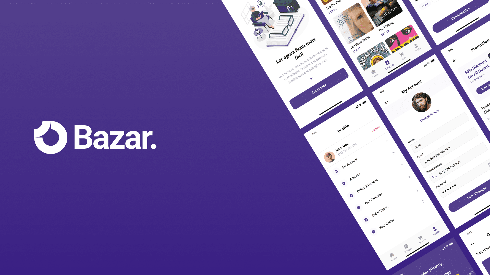

<a id="readme-top"></a>

<div align="center">
  <a href="https://github.com/Edlavio/bazar">
    
  </a>

<i align="center">Apenas por diversão</i>

</div>
 
<!-- ABOUT THE PROJECT -->
## Sobre o Projecto



O Bazar é um projeto prático que visa demonstrar a aplicação do React Native no desenvolvimento de um e-commerce. Ao longo do desenvolvimento, irei explorar diversas funcionalidades, como carrinho de compras, busca avançada e talvez integração com APIs de pagamento. Sinta-se à vontade para explorar o código e aprender comigo!

### Desenvolvido com

Lista de tecnologias usadas.

[![React Native][React Native]][React-Native-url]
[![Expo][Expo]][Expo-url]

<!-- GETTING STARTED -->

## Pré-requesitos

Para rodar esse projecto é necessário ter o [**Node.js**](https://nodejs.org/en) e o [**pnpm**](https://pnpm.io/installation)

- pnpm

  ```bash
  # Para instalar as dependências
  pnpm i

  # Para rodar o projecto
  pnpm start
  ```

  Podes também usar outros package manager:

- npm

  ```bash
  # Para instalar as dependências
  npm i

  # Para rodar o projecto
  npm start
  ```

- yarn

  ```bash
  # Para instalar as dependências
  yarn

  # Para rodar o projecto
  yarn start
  ```

<!-- ROADMAP -->

## Roadmap

- [x] Setup inicial
- [x] Auth
  - [x] Login
  - [x] Sign up
  - [ ] Recover password
- [ ] Termos e Condições
- [ ] Home
- [ ] Peril
  - [ ] Configurações
- [] Página do livro
- [] Carrinho
- [] Favoritos

  Veja as [open issues](https://github.com/Edlavio/bazar/issues) para uma lista completa de features (e issues conhecidos).

<!-- CONTRIBUTING -->

## Contribuindo

Contribuições são o coração da comunidade open source, um lugar incrível para aprender, inspirar e criar. Qualquer contribuição que você fizer é muito bem-vinda.

Se você tiver uma sugestão para melhorar este projeto, crie um fork do repositório e abra um pull request. Você também pode simplesmente abrir uma issue com a tag "enhancement". Não esqueça de dar uma estrela ao projeto! Obrigado!

1. Faça um Fork do Projeto
2. Crie sua Branch de Funcionalidade (`git checkout -b feature/NovaFuncionalidade`)
3. Faça o Commit das suas Alterações (`git commit -m 'Adicionei uma nova funcionalidade'`)
4. Envie para a Branch (`git push origin feature/NovaFuncionalidade`)
5. Abra um Pull Request

## Licença

Distribuido sobre a Licença MIT. Veja `LICENSE.txt` para mais informações.

<!-- CONTACT -->

## Contacto


Pedro Alberto - [@Edlavio](https://github.com/Edlavio) - edlavioe@gmail.com

Portfolio: [edlavio.eu.org](https://edlavio.eu.org/)

<!-- ACKNOWLEDGMENTS -->

## Agradecimentos

Agradeço ao [**DjectStudio**](https://www.behance.net/djectstudio) Pela criação do design incrível que serviu como base para este projeto. Seu trabalho impecável trouxe vida à nossa visão.

[Link do arquivo](https://www.figma.com/community/file/1314317856766658266) - https://www.figma.com/community/file/1314317856766658266

<p align="right">(<a href="#readme-top">Voltar ao topo</a>)</p>

<!-- MARKDOWN LINKS & IMAGES -->
<!-- https://www.markdownguide.org/basic-syntax/#reference-style-links -->

[React Native]: https://img.shields.io/badge/react_native-%2320232a.svg?style=for-the-badge&logo=react&logoColor=%2361DAFB
[React-Native-url]: https://reactnative.dev
[Expo]: https://img.shields.io/badge/expo-1C1E24?style=for-the-badge&logo=expo&logoColor=#D04A37
[Expo-url]: https://docs.expo.dev/
